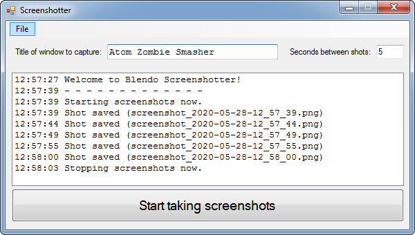

# Blendo Screenshotter
 

## About
Blendo Screenshotter takes screenshots of a specific window at regular intervals.

Image capture code is from: [https://github.com/gavinkendall/autoscreen](https://github.com/gavinkendall/autoscreen)

The purpose of this program is to automatically generate a collection of screenshots as you go about your business. This can be used for various purposes, such as:
- Gathering promotional images for your project.
- Creating a record of your project's development.
- Making a time-lapse of something.

Pre-compiled binaries are available at [my itch.io page](https://blendogames.itch.io/blendoscreenshotter).

This is written in C# and a .sln solution for Visual Studio 2010 is provided. Windows only.

## License
This source code is licensed under the [GNU General Public License v3.0](https://github.com/blendogames/screenshotter/blob/master/LICENSE).

## Credits
- by [Brendon Chung](http://blendogames.com)
- Image capture code is from: [https://github.com/gavinkendall/autoscreen](https://github.com/gavinkendall/autoscreen)
